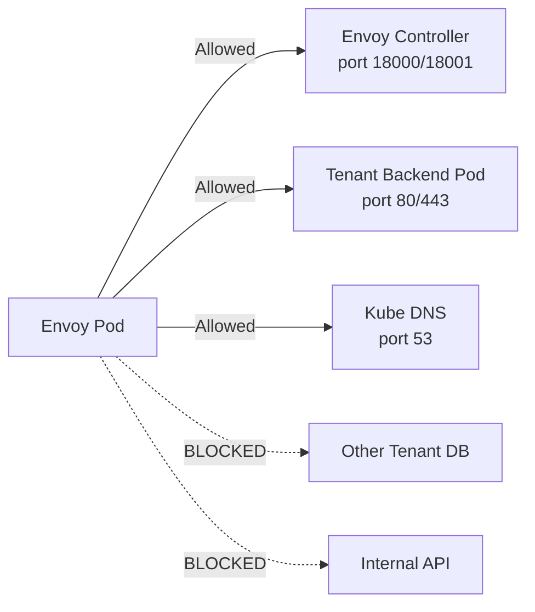
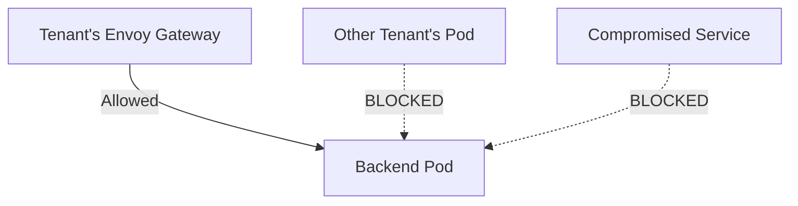

# Vishanti — Dedicated Envoy Gateway Deployment Guide

## 1. Architecture

Cilium v1.19's native Gateway API uses a shared Envoy daemonset and does not support dedicated proxies per tenant. To achieve **per-tenant isolation with resource limits**, we deploy **Envoy Gateway** alongside Cilium.

| Layer | Component | Role |
|---|---|---|
| **L7 Ingress** | Envoy Gateway | Dedicated Envoy Proxy per tenant: TLS termination, HTTP routing, resource limits |
| **L3/L4 Security** | Cilium | Network policies between Envoy pods and backend pods |

**Traffic Flow:**
```
Client → LoadBalancer (IP Whitelist) → Envoy Proxy Pod → Cilium Policy → Backend Pod
```

**Namespace Layout:**
- `envoy-gateway-system` — Envoy Gateway controller + all dedicated Envoy proxy pods
- `vishanti-<tenant>` — Backend application pods (created via UI)

---

## 2. Configuration Files

Each tenant's config is stored in `tenants/<tenant-short>/` (e.g., `tenants/lbpolicy3/`).

```
tenants/
├── lbpolicy3/
│   ├── envoy-gateway-tenant.yaml
│   ├── envoy-gateway-policies.yaml
│   └── update-default-isolation.yaml
├── lbpolicy4/
│   ├── envoy-gateway-tenant.yaml
│   ├── ...
```

| File | Purpose |
|---|---|
| `envoy-gateway-tenant.yaml` | **Core infrastructure.** `EnvoyProxy` (resource limits, `externalTrafficPolicy: Cluster`, IP whitelist), `GatewayClass`, `Gateway`, `HTTPRoute`. |
| `envoy-gateway-policies.yaml` | **Envoy pod security.** Cilium policies allowing Envoy → xDS controller, Envoy → backend, Envoy → DNS. |
| `update-default-isolation.yaml` | **Backend pod security.** Cilium policy allowing ingress from Envoy pods into the tenant namespace. |

> **Note:** `service-whitelist.yaml` is **no longer needed**. IP whitelisting is now managed permanently in the `EnvoyProxy` CRD inside `envoy-gateway-tenant.yaml`.

---

## 3. Critical Configuration Details

### externalTrafficPolicy: Cluster
- **Must be `Cluster`**, not `Local`. With `Local`, traffic hitting a node without an Envoy pod is silently dropped.
- Configured permanently in `EnvoyProxy` → `envoyService.externalTrafficPolicy` so the controller does **not** revert it.

### IP Whitelisting via loadBalancerSourceRanges
- Since `Cluster` policy performs SNAT, Cilium's `fromCIDR` cannot see client IPs. Instead, we use `loadBalancerSourceRanges` on the Service itself.
- Configured permanently in `EnvoyProxy` → `envoyService.loadBalancerSourceRanges`.

### Envoy → xDS Controller Egress
- Envoy pods **must** be able to reach the Envoy Gateway controller on ports `18000`/`18001` (xDS gRPC). Without this, Envoy has no listener config and refuses all connections.
- Configured in `envoy-gateway-policies.yaml` → `gateway-allow-egress`.

---

## 4. First-Time Installation

> **Automated Option:** Run `bash deploy-envoy-tenant.sh` after creating the tenant via UI. It handles Steps 3–7 automatically (auto-detects settings, generates YAMLs into `tenants/<name>/`, deletes Cilium Gateway, deploys, and verifies).

### Step 1: Install Envoy Gateway Controller
```bash
helm install eg oci://docker.io/envoyproxy/gateway-helm --version v1.3.0 \
  --namespace envoy-gateway-system --create-namespace
```

### Step 2: Create Tenant via UI
Create Org, Project, VPC, ALB, and Pods as usual via the Vishanti UI.

### Step 3: Gather New Tenant Details
Note down:
- **Namespace**: e.g., `vishanti-lbpolicy3`
- **Backend Service Name**: e.g., `backendpod3`
- **Backend Label**: e.g., `app=backendpod3`
- **Domain Name**: e.g., `lbpolicy3.incubera.xyz`
- **TLS Secret Name**: e.g., `lbpolicy3-tls-secret`

### Step 4: Update YAML Files

**`envoy-gateway-tenant.yaml`:**
- `loadBalancerSourceRanges` → your allowed IPs
- `Gateway.metadata.namespace` → tenant namespace
- `certificateRefs.name` → TLS secret name (matches the one created by cert-manager)
- `HTTPRoute.hostnames` → domain name
- `HTTPRoute.backendRefs.name` → backend service name

**`envoy-gateway-policies.yaml`:**
- `app:` label → backend pod label
- `io.kubernetes.pod.namespace:` → tenant namespace

**`update-default-isolation.yaml`:**
- `metadata.namespace` → tenant namespace
- `endpointSelector.matchLabels.app:` → backend pod label

### Step 5: Delete UI-Created Cilium Gateway
The UI creates a Cilium Gateway that holds the LoadBalancer IP. Delete it to free the IP for Envoy.
```bash
kubectl get gateway -n <TENANT_NAMESPACE>
# Identify the one with class: cilium
kubectl delete gateway <CILIUM_GATEWAY_NAME> -n <TENANT_NAMESPACE>
```

### Step 6: Deploy
```bash
kubectl apply -f tenants/<TENANT_SHORT>/envoy-gateway-tenant.yaml
kubectl apply -f tenants/<TENANT_SHORT>/envoy-gateway-policies.yaml
kubectl apply -f tenants/<TENANT_SHORT>/update-default-isolation.yaml
```

### Step 7: Verify
```bash
# Check Envoy service got the IP and correct config
kubectl get svc -n envoy-gateway-system | grep envoy-vishanti
kubectl get svc -n envoy-gateway-system <SVC_NAME> -o jsonpath='{.spec.externalTrafficPolicy}'

# Test connectivity
curl -k https://<YOUR_DOMAIN>/
```

---

## 5. Re-Deployment (After Namespace/Cluster Reset)

Follow **Steps 2–7** from Section 4 above. If the entire cluster was reset, also do **Step 1** first.
Existing tenant configs are preserved in `tenants/<name>/` — just re-apply them.

---

## 6. Operational Commands

**Add/Remove an IP from Whitelist:**
1.  Edit `loadBalancerSourceRanges` in `tenants/<TENANT_SHORT>/envoy-gateway-tenant.yaml`.
2.  Run: `kubectl apply -f tenants/<TENANT_SHORT>/envoy-gateway-tenant.yaml`

**Check Current Whitelist:**
```bash
kubectl get svc -n envoy-gateway-system <SVC_NAME> -o jsonpath='{.spec.loadBalancerSourceRanges}'
```

**Check Access:**
```bash
curl -k https://<YOUR_DOMAIN>/
```

---

## 7. Troubleshooting

### Timeout / Cannot Connect
1.  **Check IP whitelist**: Is your current public IP in `loadBalancerSourceRanges`?
    ```bash
    kubectl get svc -n envoy-gateway-system <SVC_NAME> -o jsonpath='{.spec.loadBalancerSourceRanges}'
    ```
2.  **Check `externalTrafficPolicy`**: Must be `Cluster`, not `Local`.
    ```bash
    kubectl get svc -n envoy-gateway-system <SVC_NAME> -o jsonpath='{.spec.externalTrafficPolicy}'
    ```

### Connection Refused
1.  **Check Envoy pod logs** for xDS timeout errors:
    ```bash
    kubectl logs -n envoy-gateway-system -l gateway.envoyproxy.io/owning-gateway-name=albpolicytest -c envoy --tail=20
    ```
2.  If you see `gRPC config stream to xds_cluster closed: connection timeout`:
    - The `gateway-allow-egress` policy is missing the rule allowing Envoy → controller (port 18000).
    - Re-apply `envoy-gateway-policies.yaml` and restart Envoy pods.

### 503 Service Unavailable
- Envoy is running but can't reach the backend.
- **Check policies**: Ensure `gateway-allow-egress` and `default-isolation` are applied.
- **Check labels**: Verify backend pod labels match the policies (`app: backendpod3`).

### LoadBalancer IP Pending
- Another Gateway (usually the UI-created Cilium one) is holding the IP.
- Delete the conflicting gateway: `kubectl delete gateway <NAME> -n <NAMESPACE>`

### Gateway Not Programmed
- Check controller: `kubectl get pods -n envoy-gateway-system`
- Check logs: `kubectl logs -n envoy-gateway-system deployment/envoy-gateway`
- Check TLS secret name matches: the Gateway `certificateRefs.name` must match the actual secret in the tenant namespace.

### UI Shows "Failed" Status
- **Expected.** The UI tracks the Cilium Gateway it created, which was deleted. The Envoy Gateway works independently. This is cosmetic only.


# Vishanti Envoy Gateway Demo — Walkthrough & Talking Points

So you're giving a demo. Here's exactly what to do and say.

## Part 1: The Execution (What to do)

### 1. **"Currently, we have..."** (Show existing state)
- Show the UI. "I have a VPC, ALB, and Pod running for `lbpolicy4`."
- Show the terminal. `kubectl get all -n vishanti-lbpolicy4`

### 2. **"Let's simulate a new tenant."** (Delete & Recreate)
- **Action**: Delete the existing VPC, Project, ALB, and Pods for `lbpolicy4` in the UI.
- **Action**: Create them again in the UI (VPC → Project → ALB → Pods).
- **Say**: "I'm provisioning a fresh tenant environment. The platform automatically creates the namespace, backend service, and TLS certificates."

### 3. **"Now, the Magic Script."** (Deploy Envoy Gateway)
- **Say**: "We need to deploy a dedicated Envoy Gateway for this tenant with specific security policies."
- **Action**: Run the script:
  ```bash
  bash deploy-envoy-tenant.sh
  ```
- **Walkthrough**:
  - Point out it *auto-detects* the new namespace (`vishanti-lbpolicy4`).
  - Point out it *auto-detects* the backend service and TLS secret.
  - **Select "Cloudflare Origin" (Option 1)**: Explain that this uses strict mTLS with Cloudflare.
  - **IP Whitelist**: "I'm whitelisting Cloudflare's IPs automatically + my custom IP."
  - **Deploy**: Watch it apply the YAMLs and delete the conflicting Cilium Gateway.
  
### 4. **"Verification."**
- The script finishes with a green "Deployment Complete!" block.
- **Action**: `curl -k https://albpolicy4.incubera.xyz` (or whatever domain).
- **Say**: "The dedicated gateway is live and serving traffic."

---

## Part 2: The Explanation (What to explain)

When they ask: **"What did that script actually do? What are these YAML files?"**

You answer: **"We are deploying a dedicated L7 Gateway per tenant, secured by Cilium at L3/L4."**

Here are the 3 key files the script generated:

### 1. `envoy-gateway-tenant.yaml` (The Infrastructure)
> **"This defines the dedicated L7 proxy for the tenant."**

- **EnvoyProxy CRD**:
  - `replicas: 2`: High availability.
  - `resources`: We set CPU/Memory limits *per tenant*. "Tenant A cannot starve Tenant B."
  - `externalTrafficPolicy: Cluster`: Essential for LoadBalancer routing on bare metal.
  - `loadBalancerSourceRanges`: **The Firewall.** This is where we whitelist Cloudflare IPs. "Traffic acts dropped if it's not from Cloudflare."
- **Gateway & HTTPRoute**: Standard Kubernetes Gateway API. Connects the domain to your backend service.
- **TLS**: Uses the **Cloudflare Origin Secret** we created. "Only Cloudflare can talk to this Gateway."

### 2. `envoy-gateway-policies.yaml` (Envoy Security)
> **"This secures the Envoy pods themselves using Cilium."**

- **Egress Policy (`gateway-allow-egress`)**:
  - "The Envoy proxy is locked down."
  - It can *only* talk to:
    1. The **Envoy Controller** (to get its config/xDS).
    2. The **Tenant's Backend Pod** (and nothing else).
    3. **DNS** (to resolve names).
  - "If this Envoy pod is compromised, it cannot attack other tenants or the control plane."

### 3. `update-default-isolation.yaml` (Backend Security)
> **"This protects the application pods."**

- **Ingress Policy (`default-isolation`)**:
  - "The backend pod (`app=backendpod4`) refuses all traffic... EXCEPT from its own Envoy Gateway."
  - "Even if another tenant's pod tries to call this service directly, Cilium drops the packet."
  - This guarantees **Tenant Isolation**.

---

## Part 3: "Why did we do it this way?" (FAQ)

**Q: Why separate Envoy pods per tenant? Why not one shared Gateway?**
**A:** "Noisy Neighbor problem. If Tenant A gets a DDoS attack or uses 100% CPU, a shared Gateway would crash for everyone. With dedicated pods, only Tenant A is affected. Tenant B is happy."

**Q: Why `externalTrafficPolicy: Cluster`?**
**A:** "For failover. If the node hosting the pod dies, traffic is routed to another node. We use `loadBalancerSourceRanges` on the Service to filter IPs because `Cluster` mode hides the client IP from Cilium's L3 policies."

---

## Part 4: Deep Dive: The Security Policies (Ingress/Egress)

This is the most critical part to explain if someone asks about security. Use these diagrams on a whiteboard or just talk through them.

### 1. The Gateway's Egress Policy (`envoy-gateway-policies.yaml`)

**Why:** By default, Envoy pods can talk to *anything* in the cluster. We want to lock that down.

> **"This policy says: The Envoy Gateway pod is allowed to make OUTBOUND connections (Egress) ONLY to these three destinations. Everything else is BLOCKED."**



**Where in the YAML?**
- `toEndpoints: matchLabels: control-plane: envoy-gateway` → Allows fetching config (xDS). **Crucial**: If you block this, Envoy fails to start.
- `toEndpoints: matchLabels: app: backendpod4` → Allows forwarding traffic to the actual app.
- `toEndpoints: matchLabels: k8s-app: kube-dns` → Allows resolving `backendpod4.vishanti-lbpolicy4.svc.cluster.local`.

---

### 2. The Backend's Isolation Policy (`update-default-isolation.yaml`)

**Why:** We don't want anyone else in the cluster (like another compromised pod) to talk to this tenant's backend.

> **"This policy says: The Backend Pod is allowed to accept INBOUND connections (Ingress) ONLY from its own dedicated Envoy Gateway. Everything else is BLOCKED."**



**Where in the YAML?**
- `ingress: fromEndpoints: matchLabels: gateway.envoyproxy.io/owning-gateway-name: albpolicytest`
- This ensures **Zero Trust**. Even if you are inside the cluster, you cannot access the backend directly. You MUST go through the Gateway (which enforces TLS and WAF).


